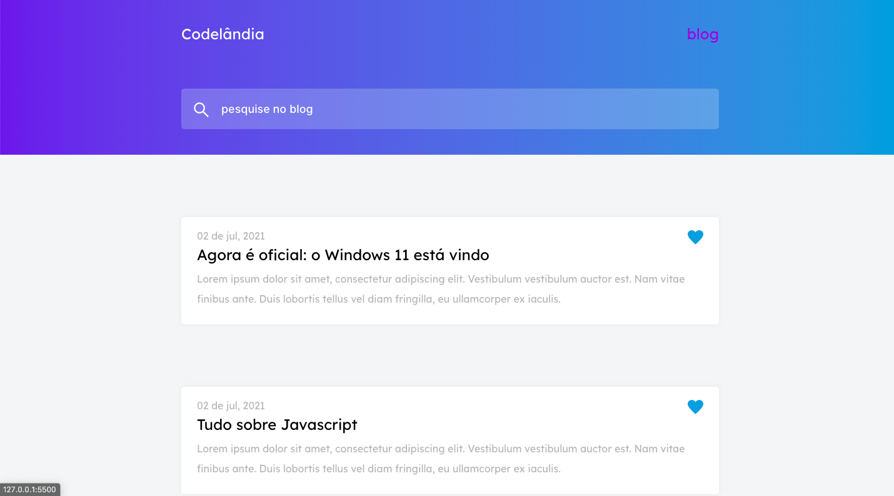
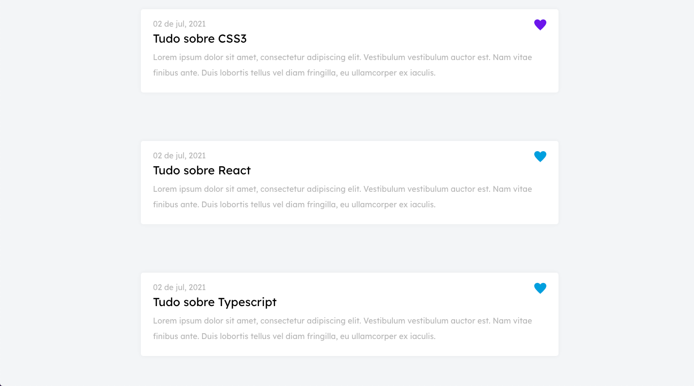

<h1 style="color:#000">Challenge</h1>

  <a href="#-tecnologias">Tecnologias</a>&nbsp;&nbsp;&nbsp;|&nbsp;&nbsp;&nbsp;
  <a href="#-projeto">Projeto</a>&nbsp;&nbsp;&nbsp;|&nbsp;&nbsp;&nbsp;
  <a href="#-layout">Layout</a>&nbsp;&nbsp;&nbsp;|&nbsp;&nbsp;&nbsp;

 

## Tecnologias

Esse projeto foi desenvolvido utilizando as seguintes tecnologias:

- [HTML5](https://www.w3schools.com/html/)
- [CSS3](https://www.w3schools.com/css/)
- [Sass](https://sass-lang.com/)
- [Javascript (scrollreveal)](https://www.javascript.com)

## Projeto

Challenge [Codelândia](https://github.com/iuricode/desafios-codelandia)
 

- Projeto responsavél pelo **[@iuricode](https://github.com/iuricode)**.

## Layout

  
  

---

Desenvolvido por Erik Ieto

